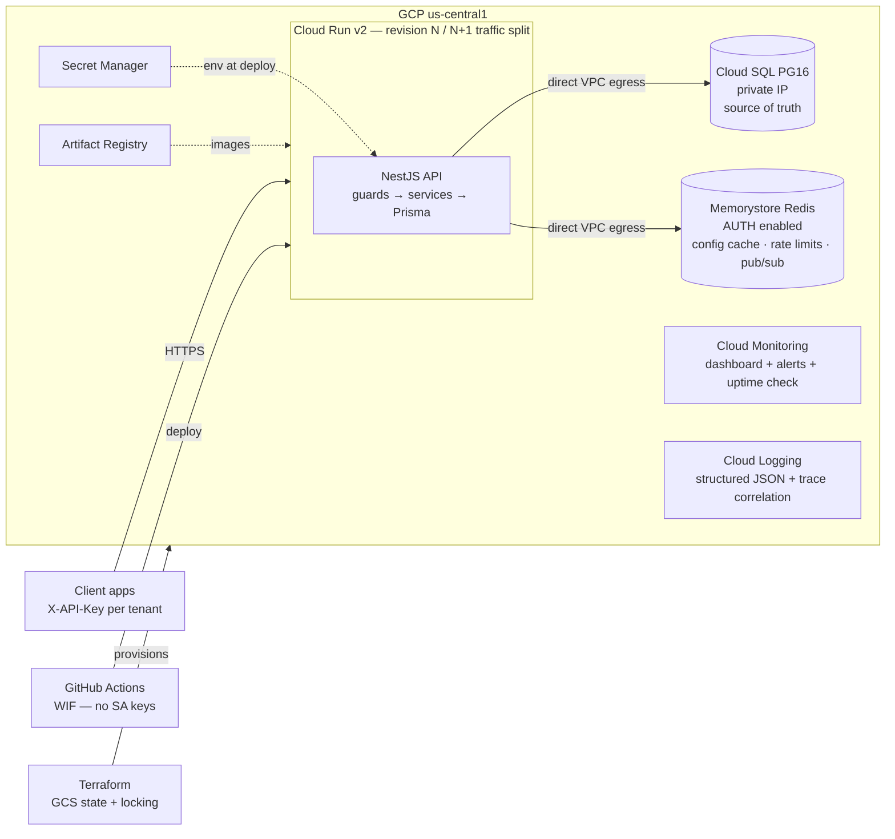
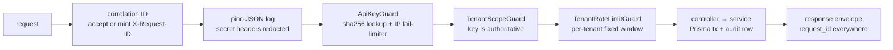
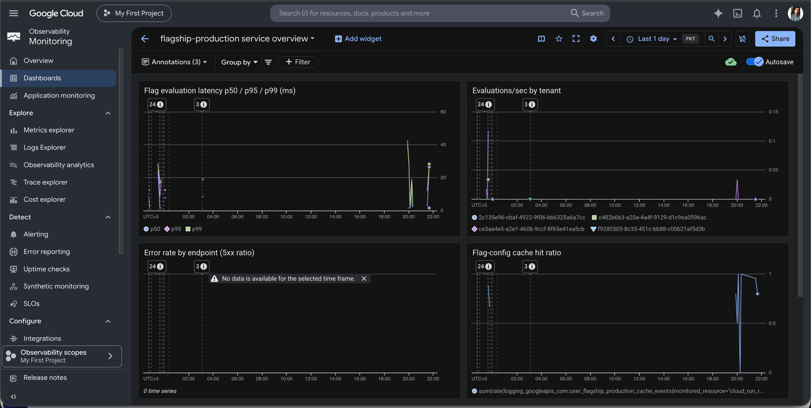
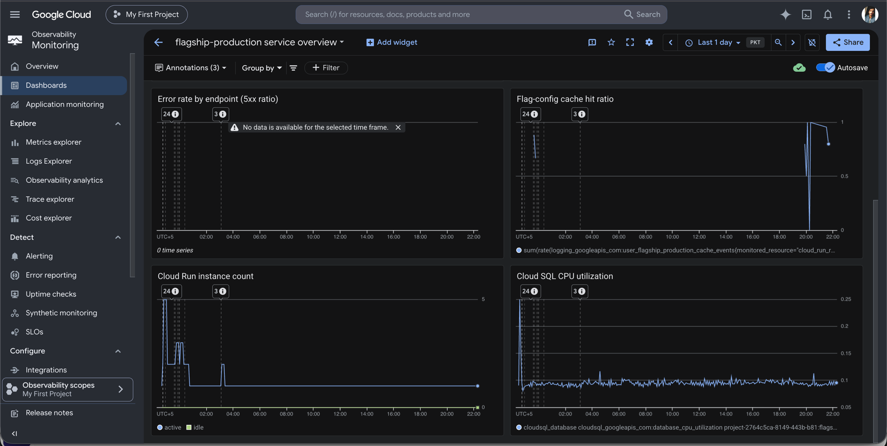
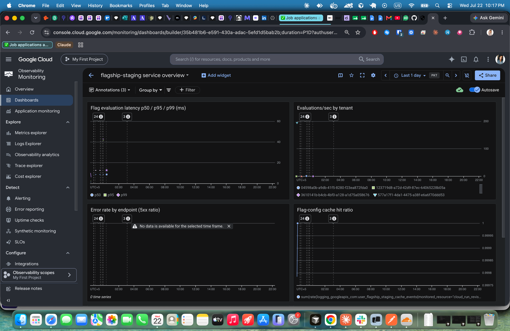
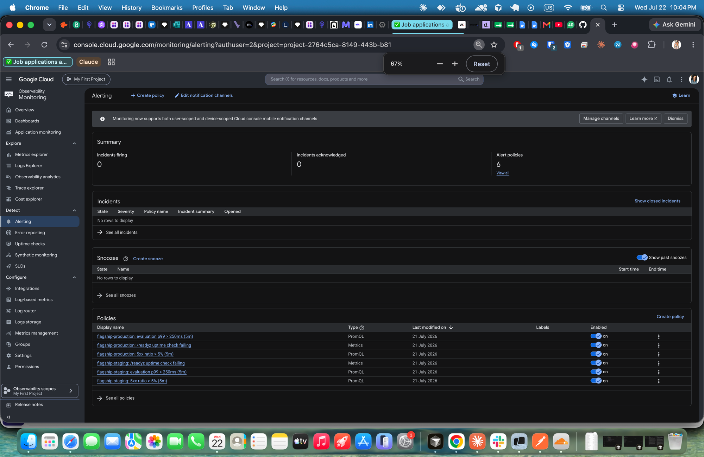
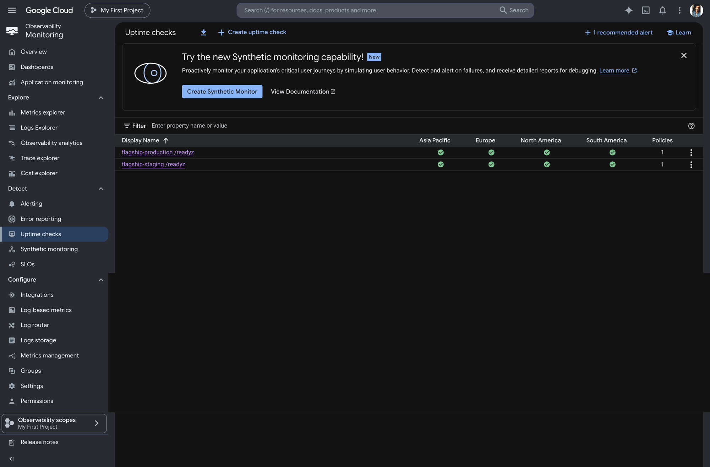
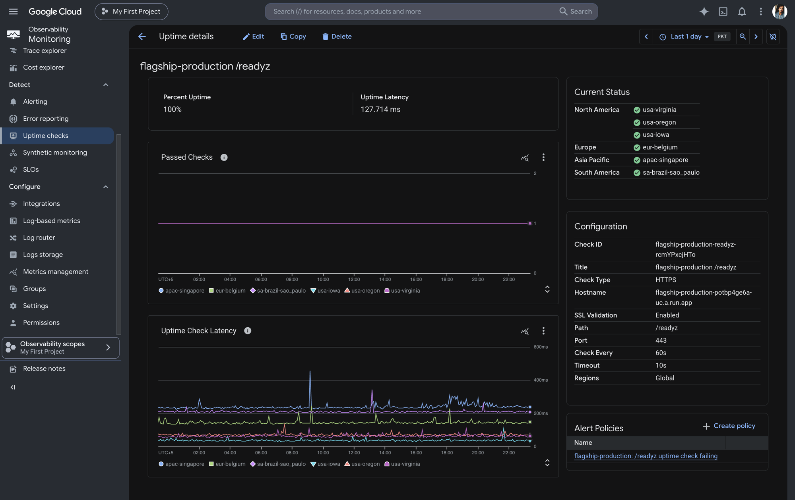
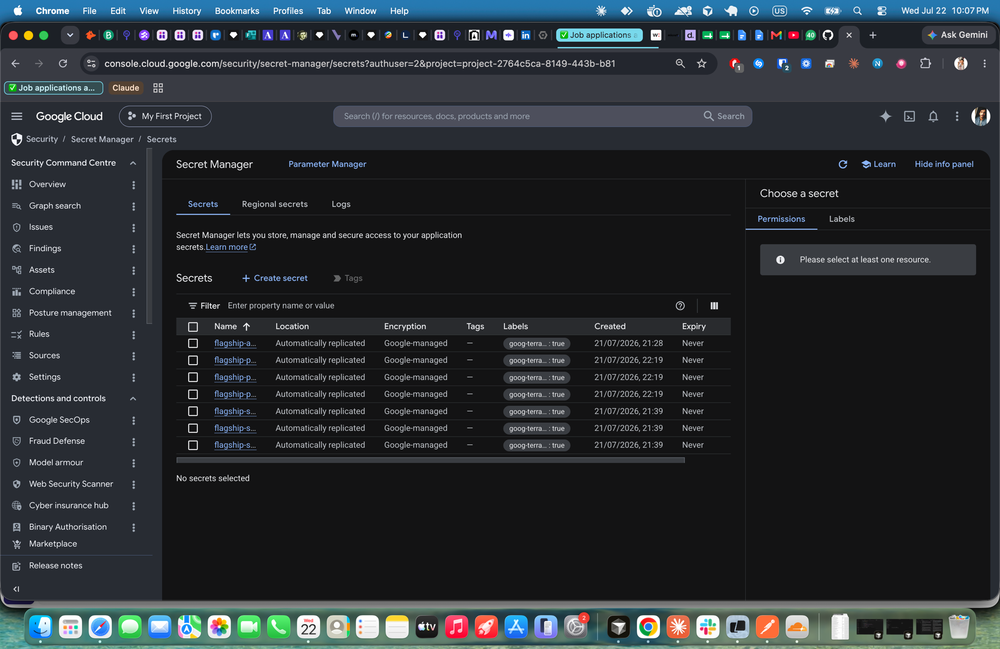

# Flagship — Multi-Tenant Config & Feature Flag Service

A simplified LaunchDarkly: multiple applications (tenants) manage feature flags and runtime
configuration through one API, with deterministic percentage rollouts, environment-scoped state,
an immutable audit trail, real-time change streaming (SSE), and a full GCP deployment story —
Terraform, canary deploys with automated rollback, and production observability.

> **Deployed URLs (live)**
> **Production**: https://flagship-production-potbp4ge6a-uc.a.run.app
> **Staging**: https://flagship-staging-potbp4ge6a-uc.a.run.app
> Demo credentials (tenant API key + evaluator admin token) are delivered in the submission
> email, never committed to this repository. Deployed through the canary pipeline (candidate →
> smoke at 0% → 10% + synthetic gate → 100%). Rollback is one `update-traffic` command — a
> manual drill via gcloud restored the previous revision in 23 s; the production workflow
> additionally rolls back automatically when the canary gate trips (see the "Automated
> rollback" step in `deploy-production.yml`).

## Quickstart (local)

```bash
git clone <repo> && cd <repo>
make up      # docker compose up + migrate + seed (api on :8080)
make demo    # scripted tour: create flag → evaluate → toggle → re-evaluate → history
make test    # unit tests; make test-integration for the e2e suite
```

The seed creates two demo tenants with deterministic keys (local-only — see
`prisma/seed.ts` for the security note):

```bash
# seed output (make up) prints each demo tenant's id + key — copy them here
curl -s -X POST localhost:8080/api/v1/evaluate \
  -H 'X-API-Key: ff_local_demo_storefront_key_0000000000000000' \
  -H 'Content-Type: application/json' \
  -d '{"tenant_id":"<demo-storefront id from seed output>","environment":"staging","user_id":"user-42"}'
```

## Architecture



### Request pipeline



### Data model

```mermaid
erDiagram
    tenants ||--o{ api_keys : "rotation + revocation"
    tenants ||--o{ flags : owns
    flags ||--o{ flag_environments : "3 rows: dev/staging/prod"
    flags ||--o{ audit_logs : "append-only (DB trigger)"

    tenants { uuid id PK; text name UK }
    api_keys { text key_hash UK "sha256 only"; text key_prefix; timestamptz revoked_at }
    flags { text key "UK(tenant_id,key)"; enum type "boolean|string|number"; jsonb default_value "the OFF value"; enum status "active|archived" }
    flag_environments { enum environment; bool enabled; jsonb serve_value "the ON value"; numeric rollout_percentage; jsonb targeting_rules; jsonb variants }
    audit_logs { text actor; enum action; jsonb old_value; jsonb new_value; text request_id "joins to logs" }
```

Every table carries `tenant_id`; `flag_environments` holds it denormalized, kept consistent by a
composite FK `(flag_id, tenant_id) → flags(id, tenant_id)`. Flag *identity* (key, type, default)
is tenant-global; flag *state* (enabled, %, rules, variants) is per-environment — the same model
LaunchDarkly and Unleash use.

## The evaluation algorithm

Every flag has an **OFF value** (`default_value`) and a per-environment **ON value**
(`serve_value`). Evaluation resolves in strict precedence order:

| Order | Condition | Result | Reason |
|---|---|---|---|
| 1 | flag archived | OFF value | `FLAG_ARCHIVED` |
| 2 | env disabled | OFF value | `FLAG_DISABLED` |
| 3 | targeting rule matches context (first match wins) | rule's serve value | `TARGETING_MATCH` |
| 4 | bucket ≥ rollout % | OFF value | `ROLLOUT_MISS` |
| 5 | in rollout, string flag with variants | weighted variant | `ROLLOUT_MATCH` |
| 6 | in rollout | ON value | `ROLLOUT_MATCH` (or `FALLTHROUGH` at 100%) |

### Deterministic percentage rollouts

```
bucket = first32bits( sha256( tenantId + ":" + flagKey + ":" + userId ) ) / 2^32 × 100
serve ON value iff bucket < rollout_percentage
```

Worked example (real numbers — verify them yourself with `node -e`):
`sha256("t1:new-checkout:user-42")` → first 8 hex chars `415a226e` → `0x415a226e / 2^32 × 100`
≈ **25.53**. At a 30% rollout user-42 is **in** (25.53 < 30); at 20% they are out. No state is
stored per user — the hash *is* the assignment.

Properties, each proven by a unit test (`src/evaluation/engine/*.spec.ts`):

1. **Deterministic** — same inputs → same bucket, forever. Stateless.
2. **Sticky under ramp-up** — a user's bucket never changes, so raising 20%→50% only *adds*
   users; nobody loses a feature mid-session. Test: enabled-set at 20% ⊆ enabled-set at 50%.
3. **Uniform** — 100k users land in each decile at 10% ± 1pp (SHA-256 avalanche).
4. **Independent across flags** — `flagKey` is hashed in, so two flags' 10% cohorts overlap in
   ~1% of users, not 10%. Without this, the same unlucky cohort would get every experiment.
5. **Tenant-isolated cohorts** — `tenantId` is hashed in.

Why SHA-256 and not murmur3: zero dependencies, well-studied avalanche behavior, and *identical
output in any language* — a future client SDK in Go or Python replicates bucketing exactly.
Speed is irrelevant here (~1µs vs request I/O). The **environment is deliberately not hashed**:
a user keeps the same bucket across dev/staging/production, so a rollout can be validated in
staging with the exact cohort it will hit in production.

Weighted variants use a **second, independent bucket** (`flagKey:__variants` hashed the same
way) walked across cumulative weights. Independence is what makes variant assignment sticky:
re-scaling the rollout bucket would re-shuffle every user's variant each time the percentage
changes, while an independent bucket fixes each user's variant for the life of the flag —
growing the rollout only ever adds users. Both properties are unit-tested.

## API

Full request/response examples in [`scripts/demo.sh`](scripts/demo.sh) (runnable: `make demo`).

| Method | Path | Auth | Purpose |
|---|---|---|---|
| POST | `/api/v1/tenants` | admin token | register tenant → API key (shown once) |
| POST | `/api/v1/tenants/{id}/flags` | API key | create flag (+3 env rows, audit) |
| GET | `/api/v1/tenants/{id}/flags?environment=&status=&page=` | API key | list, filtered, paginated |
| PUT | `/api/v1/tenants/{id}/flags/{key}[?environment=]` | API key | update; env-scoped fields need `?environment=`; `{"status":"active"}` restores an archived flag |
| DELETE | `/api/v1/tenants/{id}/flags/{key}` | API key | soft-delete (archive) |
| GET | `/api/v1/tenants/{id}/flags/{key}/history` | API key | audit trail, newest first |
| POST | `/api/v1/evaluate` | API key | evaluate for `{tenant_id, environment, user_id, context, flag_keys?}` |
| POST | `/api/v1/evaluate/bulk` | API key | all active flags for a context |
| GET | `/api/v1/stream?environment=` | API key | **SSE**: live flag-change events for tenant+env |
| GET | `/readyz` | none | readiness (DB+Redis) — the external health endpoint |
| GET | `/healthz` | none | container-internal probes only — Google's frontend intercepts this exact path on `run.app` (DECISIONS.md #10) |

Errors always use `{"error":{"code","message"},"request_id"}`. The `tenant_id` in URLs/bodies is
redundant on purpose: the API key is authoritative, and any mismatch is a cross-tenant attempt →
`403 TENANT_MISMATCH` (integration-tested from every endpoint).

Try SSE locally:

```bash
curl -N -H "X-API-Key: $KEY" "localhost:8080/api/v1/stream?environment=staging"
# in another terminal: toggle a flag → event appears here in real time
```

Multi-instance safe: events fan out via Redis pub/sub, not in-process emitters — a toggle handled
by one Cloud Run instance reaches SSE clients attached to another.

## Caching & rate limiting

**We cache flag *configs*, not per-user results.** Key `flagcfg:{tenant}:{env}` holds all of a
tenant's flags for one environment; every mutation ends with an explicit `DEL` of all three env
keys (plus a 300s TTL backstop). Config keyspace is tiny (tenants × 3), invalidation is precise,
and post-hit evaluation is pure CPU. The rejected alternative — caching evaluation results per
user — means `users × flags` keys and stale toggles after changes; documented in DECISIONS.md.
Integration test proves a toggle is visible on the *very next* evaluation.

**Redis down ≠ service down**: cache ops fall through to Postgres, rate limiting fails open
(logged). Availability of flags beats strict quota enforcement for an internal platform.

**Rate limits** (fixed 60s windows in Redis, per-env configurable):
per-tenant `evaluate` (600/min) and `management` (120/min) classes → `429` + `Retry-After` —
the noisy-neighbor defense; plus an IP-keyed limiter on the unauthenticated surface (tenant
creation, failed-auth attempts) so key-guessing floods never reach Postgres. Client IP comes from
Express `trust proxy = 1` (Cloud Run's front end appends the real IP; naive leftmost XFF is
spoofable, naive rightmost is a proxy).

## Deployment: canary with automated rollback

Cloud Run revisions are immutable, which makes blue-green/canary nearly free:

1. **Migrate** — the dedicated migrate image (`prisma migrate deploy`) runs as a Cloud Run job
   *before* any traffic shifts; migrations are expand/contract so revision N keeps working.
2. **Green at 0%** — deploy `--no-traffic` with revision tag `candidate`; the tagged URL serves
   the new revision with zero user traffic.
3. **Smoke at 0%** — `scripts/smoke.sh` runs against the candidate URL: mints a throwaway tenant
   via the admin token (from Secret Manager — no credentials in this repo), creates a flag,
   asserts disabled/enabled evaluation end-to-end, checks its key never appears in logs, cleans up.
4. **Canary 10%** — shift 10%, then drive ~200 synthetic requests through the main URL and gate
   on a >1% failure threshold. Deterministic by design: a metric-query bake on a low-traffic demo
   service would gate on empty data (documented trade-off in DECISIONS.md).
5. **Promote or roll back** — pass → 100%; fail → `gcloud run services update-traffic
   --to-revisions <previous>=100` **automatically**, and the workflow fails loudly.

Rollback is one traffic command and takes effect in seconds — but honestly: *fast, not warm*.
A 0%-traffic revision holds no service-level min instances, so the first requests after rollback
may cold-start (~2–4s). The warm variant (keep 1% on the old revision during a soak window) is in
the RUNBOOK.

## Observability

- **Logs**: pino JSON on stdout → Cloud Logging. Every line carries `request_id` (echoed as
  `X-Request-ID`, stored on audit rows — logs join to audit history), `tenant_id`, and the Cloud
  Trace field so app logs nest under their Cloud Run request log. Credential-bearing headers are
  **redacted at the serializer** (`x-api-key`, `x-admin-token`, `authorization`, cookies) — unit
  tested, and the staging smoke test greps its own request logs to prove key absence.
- **Metrics — log-based, by design**: the app emits structured events (`flag_evaluation` with
  `duration_ms` + tenant, `flag_cache` hit/miss) and Terraform `google_logging_metric` resources
  derive the custom metrics from them: evaluation latency distribution (p50/p95/p99),
  evaluations/sec by tenant, requests by endpoint/status class, cache hit ratio. Why log-based
  over an in-process OTel exporter: zero exporter risk on Cloud Run (multi-instance time-series
  collisions, CPU-throttled background flushes, SIGTERM loss are all known fights), no new
  dependencies, and the structured logs already exist. The OTel path is documented future work;
  `cpu_idle=false` is already set so switching later is config-only.
- **Dashboard + alert policies in Terraform** (PromQL — MQL is deprecated): 5xx ratio >5% over
  5min, eval p99 over threshold, uptime-check failures on `/readyz`, all routed to a
  notification channel.

  Live production dashboard, 24h view (eval latency percentiles, evals/sec by tenant, cache
  hit ratio — all derived from the log-based metrics; the empty error-rate panel means zero
  5xx served):

  

  

  Staging over 24h — the k6 load-test spike (~200 evals/sec) with per-tenant series, and the
  flag-config cache holding a ≥99.97% hit ratio under load (y-axis starts at 0.99975):

  

  All six alert policies live and enabled (both environments), routing to a **verified**
  email notification channel — the alert → first-response playbook for each lives in
  [`docs/RUNBOOK.md §6`](docs/RUNBOOK.md):

  

  Uptime checks probe `/readyz` on both services every 60s from six regions across four
  continents — production at 100% uptime, ~127ms check latency, with the failure alert
  policy attached:

  

  

  Secrets — every one Terraform-managed (`goog-terraform-managed: true`), none hand-created:

  

## Security

- API keys: 32 random bytes, `ff_` prefix, **stored as sha256 only**, shown exactly once.
  bcrypt is deliberately not used: 256-bit random keys have no dictionary to attack, and sha256
  gives O(1) indexed lookup. The `api_keys` table supports overlapping rotation + revocation.
- Admin token (tenant registration): Secret Manager-sourced, compared via `timingSafeEqual`
  over sha256 digests — the one place a naive `===` would be a real timing side channel.
- Two DB users: migrations run as the owner; the API user has DML only and **INSERT/SELECT only
  on `audit_logs`** — combined with a DB trigger raising on UPDATE/DELETE, "append-only audit"
  is enforced at two layers. Honest scope: this guards against app bugs and a compromised runtime
  credential, not a compromised table owner.
- Least privilege everywhere: API SA and migrator SA read only their own DB secrets; the CI
  deployer authenticates via **Workload Identity Federation** (no SA key JSON in GitHub), pinned
  to this repo; Terraform state (which necessarily contains DB/Redis secrets — acknowledged in
  DECISIONS.md) lives in a versioned GCS bucket the deployer cannot read.
- No working credential for any deployed URL exists in this repo. Local seed keys work only
  against your own docker-compose.

## Testing

```
make test              # 59 unit tests, <2s
make test-integration  # 28 e2e tests vs real Postgres+Redis
```

- **Engine correctness** (the graded core): the five hashing properties above, a serve-semantics
  matrix (3 types × 6 states), targeting operators, variant weight validation and distribution.
- **Tenant isolation**: tenant B's key against every one of tenant A's surfaces → 403; bulk
  evaluation never leaks another tenant's flags; same flag key coexists in two tenants.
- **Environment scoping**: enable staging-only → staging serves ON, production serves OFF.
- **Audit**: history records old/new values chronologically; raw SQL `UPDATE`/`DELETE` on
  `audit_logs` rejected by the trigger.
- **Operational behavior**: rate limit 429s with `Retry-After` (neighbor tenant unaffected),
  cache invalidation visible on next read, revoked keys 401, log redaction config.
- **Load**: `load-test/evaluate.k6.js` — warmup, ramp to 50 VUs, 2min hold, 100 VU spike, 70/30
  single/bulk mix. Thresholds are
  informational — the deliverable is measured numbers, not a self-imposed SLO pass.

| Run | RPS | p50 | p95 | p99 | errors |
|---|---|---|---|---|---|
| local (M-series, 61,460 reqs, 100 VU peak) | 245.7/s¹ | 2.9 ms | 5.6 ms | 8.4 ms | 0.00% |
| staging (Cloud Run, 47,695 reqs, GitHub US runner) | 190.7/s¹ | 48.6 ms² | 167.6 ms² | 206.4 ms² | 0.00% |

¹ Rate is pacing-limited by the scenario (per-VU sleep), not the server — local p95 stayed at
5.6 ms at peak. ² Client-side from the runner, WAN RTT included; server-side latency is the
local row. Empirical distribution checks, measured in the wild across ~109k total requests:
staging seed flag at **40% rollout → 40.3% observed match** (local run); CI-minted flags at
**50% + 25% rollout → 37.5% predicted blended match, 37.8% observed** (staging run). The
bucketing algorithm's distribution properties hold outside unit tests.

CI runs lint → typecheck → unit+integration (coverage gate: 80% lines) → `npm audit` → Trivy on
both images → `terraform validate` on every PR. With more time: SDK contract tests, mutation
testing on the engine, Redis-outage chaos test, soak testing.

## Design decisions (short form — full log in DECISIONS.md)

1. **Cloud Run over GKE/GCE** — revision traffic-splitting gives canary+rollback nearly free;
   GKE is ops burden this scope doesn't justify ("right target per service").
2. **Shared-schema multi-tenancy** — `tenant_id` on every table + key-derived scoping; DB-per-
   tenant is isolation overkill for an internal platform and an ops tax.
3. **SHA-256 bucketing** — deterministic, portable, dependency-free (details above).
4. **Cache configs, not results** — precise invalidation beats cardinality explosion.
5. **Direct VPC egress over serverless connector** — no per-hour connector cost, one less
   moving part; connector documented as fallback.
6. **Fixed-window rate limiting** — 2× burst at window edges accepted for an internal platform;
   sliding-window is the production-grade note.
7. **Prisma 6 over 7** — v7's driver-adapter/ESM rewiring buys nothing in this timebox.
8. **Deterministic canary gate over metric-driven bake** — a demo service has no organic
   traffic; a monitoring-query gate would promote (or roll back) on empty data.

## Assumptions

- Tenant registration is a platform-operator action (admin token), not self-service.
- The three environments are fixed; per-tenant custom environments are future work.
- `user_id` is an opaque string the client owns; `context` is a flat map of primitives.
- Targeting rules are deliberately minimal (`eq`/`in`, first-match-wins) — the assessment's
  focus is the rollout engine, not a rules DSL.
- One GCP project hosts both envs (credit conservation); project-per-env is the production shape.

## Deploying from scratch (operator)

```bash
# 1. One-time bootstrap: APIs, state bucket, Artifact Registry, WIF, deployer SA
terraform -chdir=infra/bootstrap init && terraform -chdir=infra/bootstrap apply
./infra/bootstrap/secrets.sh                 # mints admin + evaluator tokens out-of-band

# 2. Wire GitHub Actions to GCP (three repo secrets, from bootstrap outputs)
gh secret set GCP_WIF_PROVIDER --body "$(terraform -chdir=infra/bootstrap output -raw workload_identity_provider)"
gh secret set GCP_DEPLOYER_SA  --body "$(terraform -chdir=infra/bootstrap output -raw deployer_service_account)"
gh secret set GCP_PROJECT_ID   --body "<project-id>"

# 3. Seed images so the first apply has something to run, then apply per env
make bootstrap-image REGISTRY=us-central1-docker.pkg.dev/<project>/flagship
make tf-apply ENV=staging          # ~20-30 min first time (Cloud SQL + Redis provisioning)
make tf-apply ENV=production

# 4. From here CI owns delivery: push to main → staging; dispatch → production canary
```

## Repository layout

```
src/            NestJS app (auth/ tenants/ flags/ evaluation/ realtime/ health/ common/)
prisma/         schema + migrations (incl. audit trigger + role grants) + local-only seed
test/           integration suite (isolation, scoping, audit, limits, realtime)
infra/          Terraform: bootstrap/ + modules/{network,data,service,monitoring} + envs/
.github/        ci.yml, deploy-staging.yml, deploy-production.yml, load-test.yml
scripts/        demo.sh (local tour), smoke.sh (deploy gate)
load-test/      k6 scenario + how-to
docs/           REQUIREMENTS.md, RUNBOOK.md
DECISIONS.md    running shortcut log: what, why, what production-grade looks like
PLAN.md         the execution plan this repo was built against
```

## Future work

Auth0/OIDC for management-plane users (job-stack alignment) · per-tenant custom environments ·
SDKs with local evaluation + SSE invalidation · sliding-window limits · metric-driven canary bake
once organic traffic exists · OpenTelemetry traces · Cloud SQL IAM auth (kills passwords in state)
· flag dependency graphs & prerequisites · scheduled rollout ramps.
